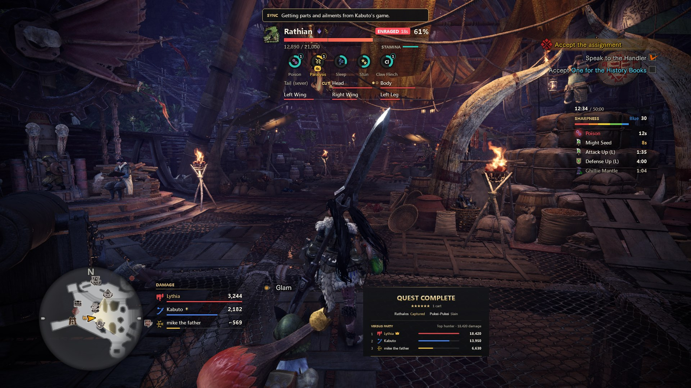
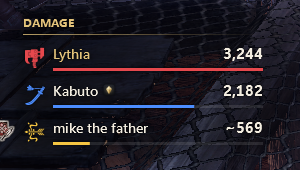
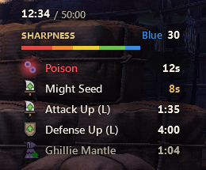
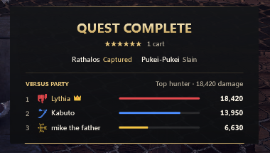
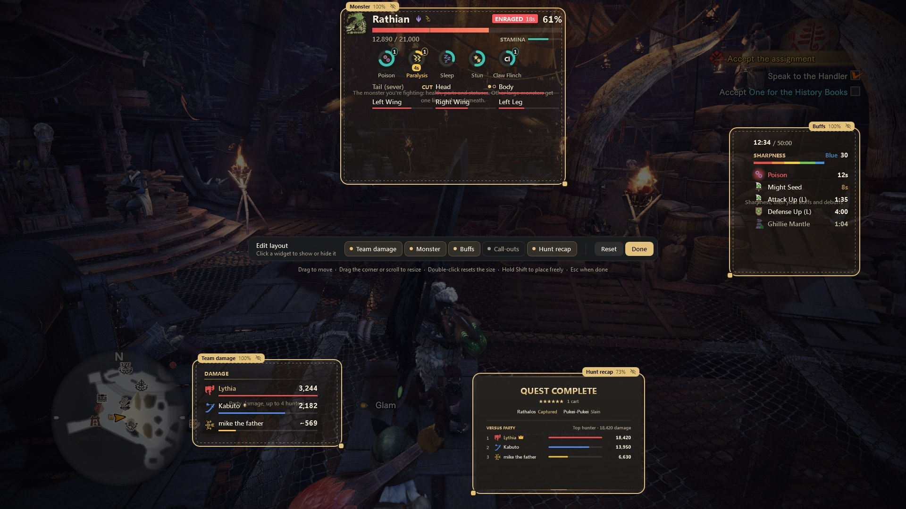
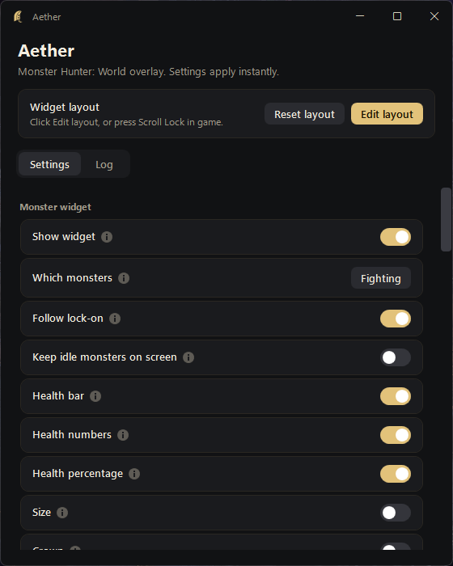

<div align="center">

[![Badge Version]][Releases]
[![Badge Downloads]][Releases]
[![Badge Platform]][Releases]
[![Badge License]][License]

---

**[<kbd> <br> 🚀 Install <br> </kbd>][Installation]**
**[<kbd> <br> 🕹 Features <br> </kbd>][Features]**
**[<kbd> <br> 🤝 Party sync <br> </kbd>][PartySync]**
**[<kbd> <br> ❓ FAQ <br> </kbd>][FAQ]**

---
</div>

# Aether

A clean, fast overlay for **Monster Hunter: World** on PC. It shows the monster you're fighting with its parts and ailments,
how much damage everyone in your party is doing, your buffs and sharpness, and a results card when the quest ends.

Aether only **reads** the game. It never changes it, injects into it or hooks it, so it can't break your game or your save.

## Requirements

- Monster Hunter: World with Iceborne on Steam (Windows 10 or 11)
- The game in **Borderless** or **Windowed** mode. Overlays can't draw over exclusive fullscreen.
- [.NET Framework 4.8](https://dotnet.microsoft.com/download/dotnet-framework/net48). Windows 10 and 11 already have it.

## Installation

1. Download `Aether-x.y.z.zip` from the [latest release][Releases].
2. Extract the whole zip and run **`Install Aether.cmd`**. It installs to `%LocalAppData%\Aether` and adds Start Menu and
   Desktop shortcuts. No admin rights needed.
3. Start the game and Aether in any order. Aether finds the game on its own.

> Windows may warn you because Aether isn't signed. Click **More info**, then **Run anyway**.

Aether **updates itself**. When a new version is out it downloads it, checks it, and shows you what changed.
To remove it, run `Uninstall Aether.cmd` in its folder.

## Features

### Monster


- Health, enrage timer and stamina of the monster you're fighting
- **Parts**: how close each one is to flinching or breaking, with a dot for each break
- **Ailments**: poison, paralysis, sleep, stun and more, with buildup and how many times they've triggered
- Weaknesses, crowns, tenderized parts and the capture threshold
- Follows the monster you **lock onto**, or the one you pin on the map
- Turf wars and double hunts get a compact line for the other monster

<br clear="right"/>

### Team damage



- Damage and share for up to 4 hunters, with their weapon and a bar
- Counts **every monster**, including expeditions, when your friends run Aether too
- The Aether logo next to a name means that hunter runs Aether too. A `~` means only their quest-target damage is known, and `—` means
  the game keeps no number for them (see [Party sync][PartySync])

<br clear="right"/>

### Buffs and sharpness



- Quest clock
- Sharpness with hits left until the next level
- Buffs, debuffs, mantles and weapon timers (Charge Blade, Insect Glaive, Long Sword, Switch Axe) with time left

<br clear="right"/>

### Hunt recap



- Shows when the quest ends: result, stars, carts, and how each monster went down
- Who did the most damage, ranked

<br clear="right"/>

### Layout editor

Press **Scroll Lock** in game, or click **Edit layout** in the Aether window. The game dims and every widget gets a tab
and a resize handle, like Discord's overlay or Lunar Client's HUD editor.



- **Drag** a widget to move it. It snaps to the screen edges, the centre lines and the other widgets.
- **Drag the corner** or **scroll** to resize. Double-click resets the size.
- Show or hide widgets from the toolbar, or with the eye on a widget's tab.
- Hold **Shift** to place freely. **Esc** or **Done** when you're finished. Everything is saved as you go.

### The Aether window



Every setting is one click and applies instantly. Hover a setting to see what it does.

- **Open with the game**: Aether waits quietly after you sign in and opens when the game starts
- **Hide while a game menu is open**, so widgets never cover the map
- **Discord Rich Presence**: your area, the monster and its health, and how the quest ended
- **Save backups**: zips your saves when the game closes, in case one gets corrupted
- A **Log** tab and a **Report a bug** button if something looks wrong

<br clear="right"/>

### Keyboard

The layout editor and hide keys can be changed in **Settings > Keyboard**: click the key and press a new one.

| Key | What it does |
| --- | --- |
| <kbd>Scroll Lock</kbd> | Open or close the layout editor |
| <kbd>F1</kbd> | Hide or show every widget |
| <kbd>F5</kbd> | Copy the team's damage split to the clipboard |
| <kbd>F6</kbd> <kbd>F7</kbd> <kbd>F9</kbd> <kbd>F10</kbd> | Copy hunter 1, 2, 3 or 4's damage |

## Party sync

Monster Hunter: World only gives the **host's** game the exact part and ailment numbers, and it keeps **no damage
numbers at all on expeditions**. Aether fills those gaps by sharing between everyone in the party who runs it, through
the SmartHunter sync server. It's on by default and only sends a hashed lobby ID, hunter names, damage and monster data.

| Who runs Aether | Monster parts and ailments | Team damage in quests | Team damage on expeditions |
| --- | --- | --- | --- |
| Everyone | ✅ Exact, from the host | ✅ Every monster | ✅ Everyone |
| The host, not everyone | ✅ Exact for the host | ✅ Quest targets for all, every monster for Aether users | Aether users only, others show `—` |
| Not the host | ⚠️ Your game's estimate, Aether tells you | ✅ Quest targets for all, every monster for Aether users | Aether users only, others show `—` |
| Only you, solo | ✅ Exact (you're the host) | ✅ | ✅ |

The more of your party runs Aether, the more you see. Friends who don't want an overlay can still help: with
**Show widgets** off (Settings > Look and behavior), Aether draws nothing but keeps reading and sharing.

## FAQ

**Can I get banned?**
Aether only reads the game's memory, the same way HunterPie and SmartHunter always have. It doesn't modify the game or
inject anything into it. World has no anti-cheat for overlays like this, but as with any third-party tool, use it at
your own risk.

**The widgets don't show up.**
Set the game to Borderless or Windowed. If they still don't show, check the card at the top of the Aether window: it
says what's wrong.

**The game updated and Aether stopped working.**
Aether finds the game's data again after most updates by itself. If it can't, it tells you, and an update for Aether
usually follows.

**My antivirus flags it.**
Reading another program's memory looks suspicious to some antivirus tools. Aether is open source: the code is all here.

## Building

```powershell
.\build.ps1 -Version 0.0.0      # build, run the self-test, zip goes in dist\
```

Needs Visual Studio 2022 or the .NET SDK with the .NET Framework 4.8 targeting pack.

## Credits

Aether started as a fork of [SmartHunter](https://github.com/gabrielefilipp/SmartHunter) by r00telement, gabrielefilipp
and dragonyue0417. Memory addresses and game data are checked against [HunterPie](https://github.com/HunterPie/HunterPie).

<!------- { Summary } ------>
[Installation]: #installation
[Features]: #features
[PartySync]: #party-sync
[FAQ]: #faq

<!------- { Links } -------->
[Releases]: https://github.com/noahwaseaten/Aether/releases/latest
[License]: LICENSE.txt

<!------- { Badges } ------->
[Badge Version]: https://img.shields.io/github/v/release/noahwaseaten/Aether?color=E2C27A&label=Version
[Badge Downloads]: https://img.shields.io/github/downloads/noahwaseaten/Aether/total?color=2E3036&label=Downloads
[Badge Platform]: https://img.shields.io/badge/Windows-10%20%7C%2011-2E3036?logo=windows&logoColor=white
[Badge License]: https://img.shields.io/github/license/noahwaseaten/Aether?color=A39C8C
