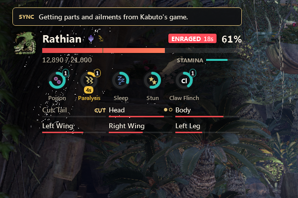

# Aether

An overlay for Monster Hunter: World on PC (Iceborne 15.20). It shows the monster you're fighting, party damage, your buffs and sharpness, and a results screen after each quest.



It started as a fork of [SmartHunter](https://github.com/gabrielefilipp/SmartHunter) that I fixed up for me and my friends. This is my first public repo, so if something breaks, open an issue.

## Install

Grab `Aether-x.y.z.zip` from [Releases](https://github.com/noahwaseaten/Aether/releases/latest), extract it and run `Install Aether.cmd`. Windows may warn you because the exe isn't signed: click More info, then Run anyway.

Aether updates itself when a new release is out.

## Using it

To move widgets, click Edit layout in the Aether window or hold Left Alt in game. Drag to move, scroll to resize. F1 hides everything while you hold it.

## Reading the monster widget

Each part has its own damage pool. The bar is what's left in it. Every time it empties the monster flinches and the pool refills. A part with dots breaks once all its dots are filled (one dot per time the pool has to empty), then it shows BROKEN. Parts without dots only flinch. "Cut:" parts like the tail come off the first time their pool empties, then show CUT.

The element icons next to the name are the monster's weaknesses: bright is 3 stars, dim is 2.

## Party sync

MHW only gives exact part HP and ailment buildup to the host, and it doesn't track damage on expeditions. If everyone in the party runs Aether with party sync on (the default), the host's numbers get shared through the SmartHunter sync server. If the host isn't running Aether, you'll still see monster health, rage and stamina, just not parts.

## Building

```powershell
.\build.ps1 -Version 1.0.2            # build and test, zip goes in dist\
.\build.ps1 -Version 1.0.2 -Publish   # same, then publish a GitHub release
```

## Credits

Built on SmartHunter by r00telement, gabrielefilipp and dragonyue0417. Memory offsets checked against [HunterPie](https://github.com/HunterPie/HunterPie-legacy).

Aether only reads game memory. Use it at your own risk.
